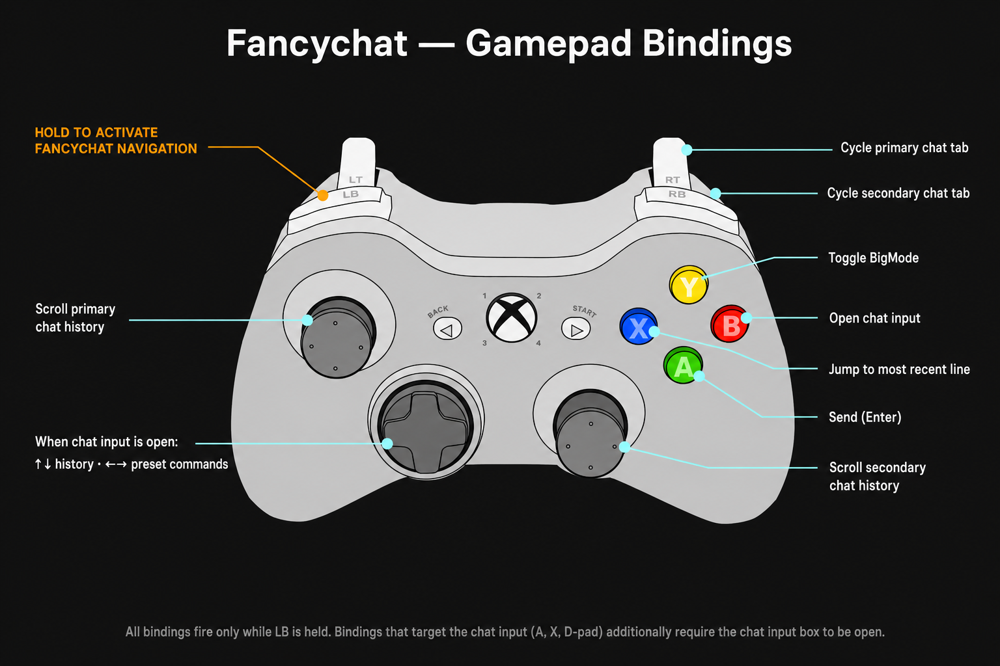

<p align="center">
  
</p>

# Fancychat

### What is it?
Fancychat is an add-on for FFXI's third-party loader and hook Ashita (https://www.ashitaxi.com/).

It replaces FFXI's native chat with a customizable in-game chat overlay: messages are sorted into tabs, combat lines can be compacted into icon-based rows, timestamps are supported, links are clickable, the chat window can be themed and resized to taste, and there's a bundled set of FFXI zone maps you can pull up by Ctrl+clicking any chat line that mentions a zone name.
<br></br>

<p align="center">
  <video src="https://github.com/user-attachments/assets/34fbe493-6b8f-465c-a0b8-181f6f5fb6e0" poster="snapshot.png" controls width="720" height="385" preload="none"></video>
</p>
<br></br>

### Main features
- **7 chat tabs** to organize messages: All (renamed AllAlt if combat is hidden from it), Combat, Linkshell, Party, Tell, Shout, Custom
- ${\textsf{\color{cyan}{Compact Combat Log}}}$ — rewrites combat messages into tight icon-based lines (icons are drawn from the bundled `gameicons.ttf` font, so they render reliably in-game)
- **Actor name coloring** — you, party members, alliance, enemies, and NPCs each get a distinct color
- **Timestamps** — per-line `[HH:MM:SS]` (long) or `[HH:MM]` (short), or a periodic horizontal banner line every 1 / 5 / 10 / 30 / 60 minutes
- ${\textsf{\color{cyan}{Auto-Hide}}}$ — chat fades out on inactivity and wakes back up on new messages on the active tab, mouse-wheel scrolling, a configured keyboard shortcut, opening the chat input, or NPC dialog events (mouse hover alone does **not** wake it — that's intentional)
- ${\textsf{\color{cyan}{BigMode}}}$ — full-screen chat history overlay showing 30+ lines at once
- **Hover previews** — hovering an auto-translate item, ability, or spell name shows a tooltip with its description / cost / properties
- **Click / Shift+click / Ctrl+click** — copy a line to the clipboard, save it to the Notepad, or pop a Zone Search panel for any zone name on the line
- **Clickable URLs** — links in chat get a `[link]` marker; clicking it opens the URL in your default browser
- ${\textsf{\color{cyan}{Zone Search}}}$ & Maps — Ctrl+left-click a chat line that mentions a zone to bring up a pop-out with `/sea`, FFXIclopedia and bg-wiki shortcuts, and a browser for the bundled maps (base maps, treasure-coffer maps, fishing maps, weather-spawn maps, and Notorious Monster maps)
- **Chat logging** — save every tab to disk on demand, organized by character and timestamp
- **Sound notifications** — incoming /tell alert plus a configurable chat-word alert (per-channel toggles)
- **Custom combat filters** — hide combat lines by keyword
- **Gamepad navigation** — optional controller support for switching tabs and scrolling
- **In-game manual** — built-in searchable help covering every feature (`/fchat manual`)
<br></br>

### Installation
Open the <a href="https://github.com/ariel-logos/Fancychat/releases" target="_blank">Releases</a> page, download the latest version, and unpack it into the `addons/` folder of your Ashita installation. You should end up with a `fancychat/` folder next to your other add-ons.

In game, type `/addon load fancychat` to start it, then `/fchat manual` for the built-in guide or `/fchat settings` to configure it. To start the add-on automatically every time you launch the game, add `/addon load fancychat` to your Ashita default script.
<br></br>

### Disclaimer
The current release is compatible with **both ${\textsf{\color{orange}{Ashita 4.30}}}$ and earlier versions** of Ashita. Going forward, however, future releases of Fancychat are likely to target **${\textsf{\color{orange}{Ashita 4.30}}}$ only** — meaning users on older Ashita versions may need to update their Ashita install to keep receiving updates. If you'd rather stay on a stable build, pin to the most recent release that explicitly notes Ashita-pre-4.30 support in the release notes.

A few small things worth knowing up front:
- Some features assume a 16:9-ish screen ratio. On very wide / narrow resolutions you may need to nudge things back into place via **Settings → Chat Window → Position Offsets**.
- A few settings are labelled ${\textsf{\color{orange}{experimental}}}$ — they work, but may behave imperfectly in edge cases.

#### Modified gdifonts library
The bundled `gdifonts/gdifonttexture.dll` is a ${\textsf{\color{orange}{modified}}}$ build of **Thorny**'s gdifonts library. The original, unmodified library lives at:

<a href="https://github.com/ThornyFFXI/gdifonttexture" target="_blank">https://github.com/ThornyFFXI/gdifonttexture</a>

The modifications add Fancychat-specific rendering behaviour (custom marked-color escape codes, additional draw paths, and other tweaks tailored to the addon's pipeline). The full source of the modified version is included in this repo under [`custom gdifonts src/`](custom%20gdifonts%20src/) for transparency and as a basis for anyone wanting to rebuild the DLL from source.

> ${\textsf{\color{orange}{If you are building your own Ashita addon and want a GDI font texture library, use Thorny's original}}}$ — not this fork. The modifications here are tightly coupled to Fancychat's rendering pipeline and are not maintained as a general-purpose drop-in replacement.

#### AI usage
Fancychat was built collaboratively with AI tools (predominantly large language models acting as coding / writing assistants). For full transparency, the main areas where AI was used:

- **Documentation** — the bulk of the README, the [`docs/`](docs/) folder pages, and the in-game manual (`help.lua`) were drafted and refined with AI assistance.
- **Code refactoring** — the split of the original single-file `fancychat.lua` (~8,700 lines) into the modular `lib/*.lua` structure, along with the inline explanatory comments throughout, was AI-assisted.
- **Bug investigation** — several bugs hunts were debugged with AI help as a final pass.
- **C++ modifications** — some of the final changes in `custom gdifonts src/` (the modified gdifonts library) were AI-assisted in a last pass.
- **Auxiliary tooling and asset prep** — the zone-map download / organisation scripts under `maps/`, the JPEG compression pass on the maps, the FancyChat logo, and the notification WAV downmix (stereo → mono / 44.1 → 22 kHz) all involved AI assistance.

Architecture decisions, feature design, in-game testing, and final-author review are mine — AI was a collaborator, not the designer. Any bugs you find are still my responsibility.
<br></br>

### 📖 Documentation
For longer reference docs see the [`docs/` folder](docs/Home.md). Every Settings tab, command, and customisation option has its own page. The in-game equivalent is `/fchat manual`.
<br></br>

### Compatibility
Fancychat is **not designed** to run alongside other add-ons that modify, reformat, or recolour incoming chat messages. Combat-log enhancers such as `simplelog`, alternative chat replacements, or anything that rewrites the chat stream are **not supported**. Running two chat-handling add-ons at the same time will produce visual conflicts (duplicated lines, broken colours, mangled formatting, missing spaces) that Fancychat will not try to recover from.

If you want to use Fancychat, unload other chat-modifying add-ons first (`/addon unload <name>`). If you prefer a different chat add-on, unload Fancychat instead.

### Functionalities

#### Commands
```/addon load fancychat``` Loads the add-on in Ashita.

```/addon unload fancychat``` Unloads the add-on.

```/fancychat``` or ```/fchat``` Base command; use with one of the subcommands below.

```/fchat settings``` Opens or closes the Settings panel.

```/fchat manual``` Opens or closes the in-game manual.

```/fchat notes``` Opens or closes the Notepad panel.

```/fchat guideme``` Opens or closes the GuideMe panel (FFXICLOPEDIA / BG-Wiki viewer).

```/fchat bigmode``` Toggles the BigMode full-screen overlay.

```/fchat savelogs``` Saves every chat tab to disk (see [Chat Logging](#chat-logging) for the path).

```/fchat compact``` Toggles compact tab mode (single cycle button vs. full tab bar).

```/fchat tod``` Toggles **Precise Time-Of-Death** stamps on enemy-killed combat lines (appends an exact `[HH:MM:SS]` to the kill line so you can record TOD for respawn-tracked NMs).

```/fchat ts``` Prints the current time as a regular chat line, using the active timestamp format.

Any of these can also be bound to an FFXI macro line (e.g. `/fchat bigmode` on a macro button).
<br></br>

#### Mouse & keyboard interactions
While hovering the chat plate:
- **Left-click a line** — copies the full line (and any continuation lines from the same message) to the system clipboard. Paste anywhere with Ctrl+V.
- **Shift + left-click a line** — saves the line to the Notepad panel instead (up to 10 entries; oldest is dropped when full).
- **Ctrl + left-click a line that contains a zone name** — opens the Zone Search & Maps popup at the cursor (see [Zone Search & Maps](#zone-search--maps)).
- **Click the `[link]` marker** next to a line that contains a URL — opens the URL in your default browser. (Clicking the message text itself still copies normally.)
- **Mouse wheel** — scrolls one line of chat history per tick.
- **Shift + mouse wheel** — scrolls several lines per tick (requires **Settings → Extra → "Fast scroll chat history"**).
- **Right-click** — jumps back to the bottom (most recent line). New messages keep buffering while you're scrolled back.
- **Drag the dark plate area** — moves the chat window. Lock it from **Settings → Chat Window → "Lock Windows Positions"**.

There's also a small info-icon hover button in the top-left of the primary chat window that pops up a built-in quick-reference of these interactions; hide it from **Settings → Chat Window → "Show help (i) hover button on the first chat window"** if you don't want it.
<br></br>

#### Gamepad navigation
Enable in **Settings → Chat Window → "Gampad Chat Navigation"** (off by default). Once on, **hold the ${\textsf{\color{orange}{Left Bumper (LB)}}}$** at any time to enter Fancychat's gamepad navigation mode — every other binding below only fires while LB is held. Release LB to return your controller to normal FFXI use.

<p align="center">
  
</p>

| Action | Xbox button | When it works |
|---|---|---|
| Enter Fancychat navigation mode | Hold ${\textsf{\color{orange}{LB}}}$ | Always |
| Cycle primary chat tab | **RB** | While LB held, chat input closed |
| Cycle secondary chat tab | **RT** | While LB held, chat input closed, secondary window enabled |
| Scroll primary chat history | **Left stick ↑/↓** | While LB held |
| Scroll secondary chat history | **Right stick ↑/↓** | While LB held |
| Snap every chat window to the most recent line | **B** | While LB held |
| Toggle ${\textsf{\color{cyan}{BigMode}}}$ | **Y** | While LB held |
| Open the FFXI chat input box | **X** | While LB held, chat input closed |
| Send the typed text (same as Enter) | **A** | While LB held, chat input open |
| Previous command in your typed history | **D-pad ↑** | While LB held, chat input open |
| Next command in your typed history | **D-pad ↓** | While LB held, chat input open |
| Previous preset command (`!mog`, `!chef`, …) | **D-pad ←** | While LB held, chat input open |
| Next preset command | **D-pad →** | While LB held, chat input open |

> Bindings activate immediately after enabling the setting — no addon restart needed. If a binding seems unresponsive, double-check whether the chat input box is open or closed: several actions are state-specific (see the column above).
<br></br>

#### Chat Tabs
The tab bar at the top of the chat window lets you switch between up to 7 tabs:

- **All** — every message (renamed **AllAlt** if you tell Fancychat to drop combat and custom lines from it in **Settings → Extra → "Hide combat and custom logs from 'All' tab"**)
- **Combat** — melee hits, spells, abilities, and status effects
- **Linkshell** — linkshell messages
- **Party** — party chat
- **Tell** — tells sent and received
- **Shout** — shout and yell messages
- **Custom** — configurable tab that can include any combination of: NPC dialogue, tells, party, linkshell, and shout

Tabs can be shown as a full tab bar or switched to compact mode (`/fchat compact`), where a single button cycles through them. Keyboard shortcuts for cycling tabs on both the primary and secondary windows can be configured in **Settings → Shortcuts**.
<br></br>

#### Compact Combat Log
${\textsf{\color{cyan}{Compact Combat Log}}}$ is toggled in **Settings → Extra**. When on, incoming combat messages are rewritten into a condensed, icon-based format to reduce visual noise while keeping every relevant detail visible at a glance. Actor names are coloured by role and damage numbers are highlighted.

Icons used in compact mode (the symbols below are GitHub-rendered approximations; in-game they are drawn as custom glyphs from the bundled `gameicons.ttf`):
<ul>
  <li>${\textsf{\color{white}{⚔}}}$ — melee attack</li>
  <li>${\textsf{\color{white}{🏹}}}$ — ranged attack</li>
  <li>${\textsf{\color{white}{✨}}}$ — magic / spell</li>
  <li>${\textsf{\color{white}{⭐}}}$ — critical hit</li>
  <li>${\textsf{\color{white}{→}}}$ — action result / damage</li>
  <li>${\textsf{\color{white}{✗}}}$ — miss / resist</li>
</ul>

A ${\textsf{\color{orange}{colorblind mode}}}$ is available in **Settings → Extra**, which swaps the red-green colour palette used for actor names.

##### Combat log filtering
Three quick toggles in **Settings → Extra** let you narrow the combat tab down:
- **Hide alliance combat log** — drops alliance-member combat lines
- **Hide non-party combat log** — drops non-party combat lines (alliance still visible unless the above is also on)
- **Only show you and your pet logs** — narrowest filter

For more surgical control, use combat filter files (`combatfilters/*.txt`). Pick the active file via the **Active filter file** dropdown in **Settings → CL Filters**. Each line is a word or phrase that, if found in a message, hides that message. Adding ` _y` at the end of a line means "filter everyone EXCEPT me" — your own actions still show. Adding ` _p` means "filter everyone EXCEPT me and my party". Use **Edit Selected Filter** to open the active file in your text editor, **Reload Selected Filter** to pick up your edits, and **Open Folder** to manage the files in Explorer.
<br></br>

#### Zone Search & Maps
${\textsf{\color{cyan}{Zone Search}}}$ & Maps is triggered by Ctrl + left-clicking any chat line that mentions a zone name — a small action popup opens at the cursor. For each zone detected on the line, the popup shows:

- ${\textsf{\color{white}{/sea \"Zone Name\"}}}$ — runs the standard FFXI zone-search command for that zone (quoted, so multi-word zones like `Rolanberry Fields` work)
- **Open Zone on FFXIclopedia** — opens the zone's FFXIclopedia page in your browser
- **Open Zone on bg-wiki** — same, for bg-wiki (useful when Cloudflare blocks FFXIclopedia for you)
- A collapsible map browser, with sections shown in this order (empty sections hidden):
  - **Maps** — the zone's base floor / area maps
  - **Treasure** — coffer-spawn and chest-spawn maps
  - **Fishing** — fishing-spot maps showing what catches where
  - **Weather** — elemental-spawn maps, organised by weather type
  - **Notorious Monsters** — one entry per NM, labelled with the monster's name

Click any map entry to open it in a new resizable window — drag the bottom-right corner to scale. Multiple maps can be open at once.

The maps live in `addons/fancychat/maps/<Zone Name>/<Section>/` as PNG / JPEG files. You can drop your own images into the appropriate subfolder and they'll appear in the popup the next time you open it for that zone.
<br></br>

#### BigMode
${\textsf{\color{cyan}{BigMode}}}$ is a full-screen overlay that shows the same chat buffer as the primary window but with many more visible lines (30+). Useful for reviewing recent chat history without scrolling.

Toggle BigMode with `/fchat bigmode` or by configuring a keyboard shortcut in **Settings → Shortcuts**. All four shortcuts (Hide, BigMode, Tab cycle window 1, Tab cycle window 2) are ${\textsf{\color{orange}{disabled by default}}}$ — tick the Enabled checkbox and pick a key combo (e.g. Shift+G) to activate them. BigMode uses its own independent scroll cursor so switching back to the primary window does not disrupt your scroll position there.
<br></br>

#### Sound notifications & alerts
Two independent sound features:

- **Incoming /tell notification** — plays a sound whenever a tell arrives. Enable and pick a sound from **Settings → Extra → "Incoming /tell notifications"**. There's a **Volume Boost** checkbox next to the dropdown that switches to a louder variant of the same sound.
- **Chat word alert** — plays a sound whenever any word from a configurable list appears in chat. Per-channel toggles let you choose which channels trigger the alert (so you can alert on `your name` mentions in shout but not in combat, for example).

Both pull from `addons/fancychat/notifications/`. The two dropdowns each show six fixed slots: `notification_1` through `notification_6`. To use your own sounds, **replace** the shipped `.wav` files of the same name (don't add new ones — extra filenames are not picked up by the dropdowns). For the **Volume Boost** option you also need to provide the matching boosted variant: each base file `notification_<n>.wav` has a sibling `notification_<n>B.wav` that the addon plays when Volume Boost is ticked.
<br></br>

#### R0 Detection
A **Warning messages on R0s** toggle (also in Extra) prints a chat warning when an R0 connection error occurs, so you can see a hiccup at a glance.
<br></br>

#### Settings Panel
Open the Settings panel with `/fchat settings`. It contains six tabs:

<ol>
  <li><b>Chat Window</b>: font size, chat width, line count, plate background alpha, second chat window, custom-tab message types, position offsets, window locks, the info-icon help button toggle, compact-tab mode, half-length docked panels, anti-obstruction (auto-slide when an FFXI menu or the Auto-Translate menu opens), auto-hide delay, gamepad navigation.</li>
  <li><b>Font Colors</b>: per-message-mode colour editor. Colour picker UI plus Import / Export — clicking <b>Export Colors</b> opens a dialog where you can name the file (suggestion: <code>colorset_&lt;character&gt;_&lt;N&gt;</code>, auto-incrementing); clicking <b>Import Colors</b> opens a picker listing every colorset file in <code>addons/fancychat/chatcolors/</code>. Drop a friend's colorset file into that folder and you can import it from your own character — no renaming required.</li>
  <li><b>Shortcuts</b>: configure 2-key combos (modifier + main key) for: hide chat, BigMode, tab cycle (primary window), tab cycle (secondary window). All four default to disabled — tick the <b>Enabled</b> checkbox per row to activate one.</li>
  <li><b>Extra</b>: block legacy chat, combat-log filtering toggles (hide alliance / non-party / show-only-you), Compact Combat Log toggle, timestamp format and timestamp-as-line interval, precise time-of-death stamps, R0 connection-error warnings, /tell sound notifications, chat-word alerts, item/ability/spell hover previews, auto-restore logs when opening legacy chat, colorblind mode, fast scroll (Shift + mouse wheel), docked second window.</li>
  <li><b>CL Filters</b>: <b>Active filter file</b> dropdown to pick which <code>.txt</code> in the <code>combatfilters/</code> folder is used as the active filter list, with <b>Refresh</b> / <b>Edit Selected Filter</b> / <b>Reload Selected Filter</b> / <b>Open Folder</b> buttons. Supports keywords with <code>_y</code> / <code>_p</code> scope modifiers.</li>
  <li><b>Tools</b>: save chat logs, open the logs folder, open the in-game manual, restore legacy chat.</li>
</ol>
<br></br>

#### GuideMe & Notepad
The ${\textsf{\color{cyan}{GuideMe}}}$ panel (`/fchat guideme`) is a built-in viewer for FFXICLOPEDIA and BG-Wiki pages, displayed as wrapped text directly in-game — no alt-tabbing required. Paste a URL into the field at the top of the panel and press Load.

The ${\textsf{\color{cyan}{Notepad}}}$ panel (`/fchat notes`) is a per-character note keeper. Shift-clicking any chat line saves it to the Notepad (up to 10 entries). Each saved note has a small **C** button to copy it to the clipboard and an **X** to delete it. Notes persist between sessions.

Both panels can be docked above the primary chat window (the default) or undocked into a movable window with the Dock/Undock button. When the second chat window is enabled, you can dock them there instead via **Settings → Extra → "Dock GuideMe/Notes on the second chat window"**.
<br></br>

#### Chat Logging
Chat logs are saved on demand by `/fchat savelogs` or the **Save Chat Logs** button in **Settings → Tools** to:

```
Ashita/config/addons/fancychat/logs/<character>/ChatLogs_YYYY_MM_DD-HH_MM_SS/
├── All.txt
├── Combat.txt
├── Linkshell.txt
├── Party.txt
├── Tell.txt
├── Shout.txt
└── Custom.txt
```

Logs are *not* auto-saved when the add-on unloads. The **Open Logs Folder** button in **Settings → Tools** opens that folder in Explorer.

The separate **Auto-restore logs when opening Legacy Chat** option (Extra tab) re-injects buffered chat into the FFXI legacy chat window each time you open it — useful for taking native-chat screenshots for support tickets.
<br></br>

#### Where files live
Quick reference (see [docs/Data Storage](docs/Data-Storage.md) for the full layout):

- **Settings (per character)** — `Ashita/config/addons/fancychat/<character>/settings.json` — saved automatically whenever you change something. Holds tab selection, font size, shortcut keys, alert words, your Notepad notes, and every checkbox state.
- **Color sets** — `Ashita/addons/fancychat/chatcolors/colorset_*` — written by **Font Colors → Export Colors**. Plain text; you can keep multiple palettes per character. Drop someone else's file in this folder to import it.
- **Combat filters** — `Ashita/addons/fancychat/combatfilters/*.txt` — user-managed. The shipped file is `example.txt`.
- **Saved chat logs** — `Ashita/config/addons/fancychat/logs/<character>/ChatLogs_<timestamp>/` (see above).
- **Notification / alert sounds** — `Ashita/addons/fancychat/notifications/*.wav` — drop your own here.
- **Zone maps** — `Ashita/addons/fancychat/maps/<Zone Name>/<Section>/` — bundled with the addon; you can add your own images to any section folder.
<br></br>

### Credits

A heartfelt thank you to:

- The **[Ashita](https://www.ashitaxi.com/) team** — for all the help and patience answering my questions while building this add-on, and for the framework that makes it possible in the first place.
- **atom0s** — for the `targets.lua` script that powers Fancychat's actor / target resolution and the infinite patience to guide me through all the RE nuances.
- **Thorny** — for the gdifonts library that powers the custom-font texture rendering pipeline and the invaluable help I received despite all my dull moments.
